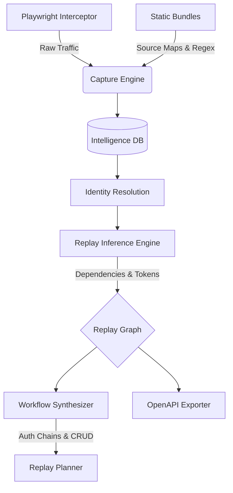

# ApiGen

> **The frontend is leaking the backend in real time.**

ApiGen is a protocol archaeology and reverse-engineering platform that discovers hidden backend structures entirely from frontend behavior. 

Most API tools document what developers *intended* to build. ApiGen documents what *actually happens*.

By intercepting runtime network traffic, recovering static bundles, and analyzing state dependencies, ApiGen reconstructs the invisible systems powering modern web applications. You browse. ApiGen reconstructs the backend.

---

## ⚡ Quickstart

```bash
# 1. Capture traffic by simply using the target app
apigen capture https://leetcode.com

# 2. Analyze the discovered backend structure
apigen summarize

# 3. Reconstruct into a standard OpenAPI 3.0 specification
apigen export ./openapi.json
```

---

## 🛠 Installation

Install the CLI globally via npm. ApiGen uses Playwright under the hood to intercept and manage isolated browser sessions.

```bash
npm install -g auto-api-discovery
```

*(Note: The `postinstall` script will automatically download the Chromium binaries required for runtime interception.)*

Alternatively, run it immediately via `npx`:

```bash
npx auto-api-discovery capture https://example.com
```

---

## 🎬 CLI Flow

ApiGen works in phases: capture the traffic, infer the relationships, synthesize the workflows, and export the specification.

### 1. Capture Interception
Launch an interactive, instrumented browser. Log in, bypass captchas, and trigger workflows. ApiGen silently monitors all REST, GraphQL, WebSocket, and SSE traffic, storing the raw intelligence locally.

```bash
apigen capture https://leetcode.com
```

### 2. Autonomous Crawling (Spidering)
Use your authenticated session to crawl connected pages headlessly. ApiGen will execute bundles, trace endpoints, and build a map of the app's surface area.

```bash
apigen crawl https://leetcode.com --depth 3 --pages 50
```

### 3. Intelligence Summary
Analyze the captured data to see what ApiGen has inferred about the backend architecture. 

```bash
apigen summarize
```

**Example output:**
```
  ApiGen — Session Summary
────────────────────────────────────────────────────

  📊  Session Overview

  Total requests              39
  Total endpoints             14
  GraphQL operations          2
  Workflows discovered        4
  Auth chains                 1

────────────────────────────────────────────────────

  🔗  Endpoint Overview

  REST endpoints              13
  GraphQL endpoints           1
  WebSocket endpoints         0
  Observed                    10
  Inferred                    4

  Top route families:
    /api/auth                      (2 endpoints)
    /api/users                     (4 endpoints)

────────────────────────────────────────────────────

  🔄  Workflow Overview

  authentication              1
  CRUD                        2
  unknown                     1

  Replay viability:
    safely replayable            1
    partially replayable         2
    high-risk replay             1

  Critical workflow paths     3

────────────────────────────────────────────────────
```

### 4. Specification Export
Convert the raw graph of endpoints into a clean OpenAPI 3.0 document. ApiGen automatically folds dynamic UUIDs, hashes, and numeric IDs into path parameters.

```bash
apigen export ./openapi.json --base-url https://api.example.com
```

---

## 🧠 How It Works

ApiGen is built on a rigid architectural pipeline:
`Capture → Inference → Graph → Workflows → Export`



### 1. Discovery Pipeline
ApiGen doesn't just listen to the network. It combines multiple vectors to find endpoints:
- **Runtime Capture:** Directly intercepting XHR/Fetch calls during your session.
- **Static Bundle Extraction:** Parsing minified JS bundles and source maps for hidden routes.
- **Persisted Query Recovery:** Matching hashed GraphQL payloads against observed queries.
- **Inferred Routing:** Detecting frontend route definitions and mapping them to expected backend endpoints.

### 2. Endpoint Identity Resolution
Endpoints are dynamically deduplicated. ApiGen merges `GET /api/users/123` and `GET /api/users/456` into a canonical `GET /api/users/:id`. It tracks the *Trust State* of each endpoint, upgrading it from `inferred` to `observed` when an endpoint found in a static bundle is actually executed at runtime.

### 3. Replay Analysis & Inference
ApiGen calculates the exact semantic dependencies required to replay an API call.
- It tracks **Tokens, Cookies, and UUIDs** flowing across responses and subsequent requests.
- It performs **Semantic Token Classification**, identifying JWTs, opaque hashes, or timestamps, adjusting confidence scores dynamically (e.g., ephemeral timestamps are heavily penalized; JWTs are highly trusted).

### 4. Replay Graph & Workflow Synthesis
ApiGen constructs a massive directed graph of the application's state. It runs graph-theory and topological analyses to group raw requests into intelligent **Workflows**.
- Groups are logically separated by **Route Families** and **Auth Boundaries**.
- Discovers **Auth Chains**, linking the initial `POST /login` all the way through the protected downstream requests.
- Identifies **Critical Paths**, stripping away background noise (like telemetry or images) to expose the sequential backbone of the workflow.

### 5. GraphQL Deep Introspection
Modern web apps hide entire backend ecosystems behind a single `/graphql` endpoint. ApiGen cracks this open by parsing GraphQL ASTs in real time, detecting fragments, variables, and operation names. If a server allows it, ApiGen will also silently attempt a full schema introspection.

---

## 🔬 Provenance Tracking

ApiGen treats API endpoints like forensic evidence. Every discovered endpoint maintains a strict lineage of how it was found:
- `runtime_capture` - We saw the browser make this request.
- `static_bundle` - We extracted this URL from a minified Javascript chunk.
- `persisted_query` - We recovered this GraphQL document from a hashed payload.
- `inferred_route` - We found a frontend route that implies this backend endpoint.

---

## 🛑 Limitations

- **Replay execution** is currently analytical only. The engine builds the execution plan but does not actively fire destructive replays.
- Extremely heavily obfuscated bundle extraction might yield false positives.
- Replay analysis struggles with endpoints that employ heavy client-side request signing (e.g., HMAC-SHA256 of the payload + timestamp) since it breaks linear token dependency chains.

---

## 🗺 Roadmap

- [ ] Active Workflow Execution (running synthesized plans autonomously)
- [ ] Agentic Exploration Planner (allowing an AI to actively explore `unresolved` routes)
- [ ] Semantic Fuzzing / Attack Surface generation
- [ ] WebAssembly interception support

---

## 💡 Philosophy

**Runtime traffic doesn't lie.**

Source code gets stale. Documentation is aspirational. Developer assumptions are often wrong. But the bytes flying over the wire are the unvarnished truth of how a system operates. 

ApiGen was built for security researchers, reverse engineers, and system architects who need to rapidly understand an undocumented or hostile backend ecosystem. By shifting from static analysis to dynamic runtime intelligence, ApiGen exposes the actual, breathing structure of modern applications.

---

*ApiGen is licensed under the MIT License.*
